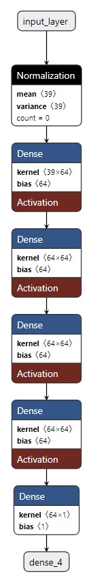

# Auto MPG

The goal of this problem is to predict fuel efficiency of automobiles in miles per gallon (MPG) based on various features of the cars. This problem involves using regression techniques to model the relationship between the MPG and the car's characteristics.

The project is structured in 4 different notebooks listed below.

1) [get_data.ipynb](scripts/get_data.ipynb): 

    Extract the dataset from a link as a csv file in the data folder.

2) [transform_data.ipynb](scripts/transform_data.ipynb):

    Transform the data and save a csv file in the data folder as well. Transformations applied map the integer values from the origin map to their respective countries, splits car manufacturer and car model into two different columns and map mispelled manufacturers to their correct names.

3) [data_vizualizations/ipynb](scripts/data_visualizations.ipynb):

    Creates some vizualitations with the transformed data to understand the relationship between the target and features and between features themselves. Also input missing values in the horsepower column. In the end, saves the data as a csv file in the data folder again.

4) [model.ipynb](scripts/model.ipynb):

    Train models sequentially by implementing new layers in the neural network. It starts with a basic linear regression and improves the complexity of the model by adding more parameters in new hidden layers, new non-linear activation function ReLU, changing learning rate, etc. Last trained model can be seen below:

    

